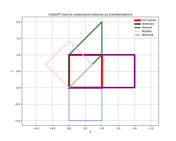
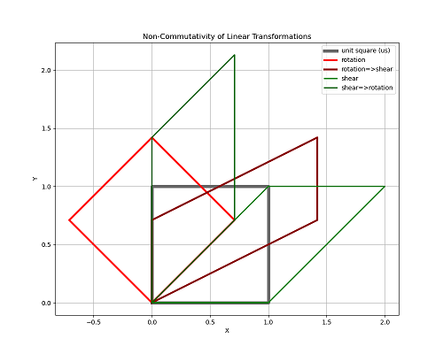
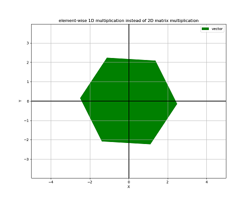
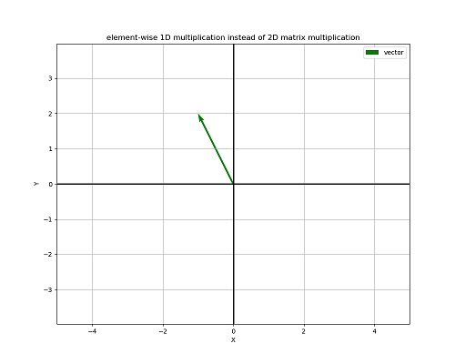
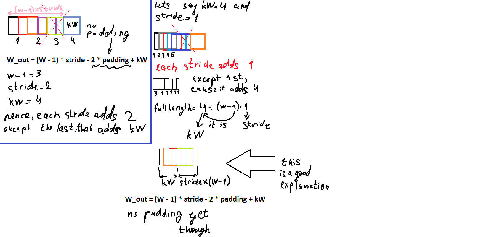

**2025-07-06**\
There are 3 kinds of multiplication in the ML I know thus far:
- inner product (standard matrix multiplication, the result is a matrix or a schalar)
- outer product (like the inner product, but with vectors, the result is a matrix)
- Kronecker product (it's like the outer product of 2 matrices, the result is a matrix bigger than the previous ones)

**2025-07-07**\
Today I was discussing the psychology of ML and studying, particularly my tendency to understnad the math equations and systems through aligning my inner feelings (emotions, proprioception, etc) with how the equation/system works. ChatGPT told me it's how top scientists work with their ideas. The possible names for this are:
- embodied learning
- algorithmic identification
- systemic empathy
- becoming-the-system
The problem is that when I impersonate some system, I begin work with myself, and it can be hurtful for the ego. I need to understand that I apply my tools to something external, and apply this embodied learning more sparingly.\
I completed (rewrote from the QWENs text) the program, and understood everything (not as solid as I understand FFNNs (I don't like this abbreviation)). The most difficult part for me is recreating the derivation of the softmax function (about why exactly dz[label]-=1), the explanation of it is rather long. But I'll return to it later, I'm sure it's not so hard to understand.


**2025-07-08**\
14:08:22. Today I read the code for the backpropagation of the fully connected and conv2d layers. Also I try to use the Sublime Text, because it compiles much faster than VSC. And I try to use the Sublime Merge to upload the code to the Github.

**2025-07-09**\
Idk why it doesn't want to insert the date and time in the format dd.mm.yyyy, but fuck it. I don't really care, let it be raw.\
So yesterday I spent a lot of time (whole day), trying to make VSC to work with both .py and .cpp code. It turned out that I just put all files into one folder with the same launch.json and tasks.json file, so those files couldn't operate the compilation and debbugging of all files (considering that C++ needs compilation, and Python doesn't, plus debuggers for them are different). So in the end I put them into 2 different folders, deleted the folders .vsc (to let VSC create blank ones) => and everything started to work. Then I asked ChatGPT and QWEN for some tweaks to those files to make everthing look better.

**2025-07-11**\
Explored the natural logarithms and their role in the calculation of the Cross-Entropy Loss. I'm rather familiar with it, but repeating to improve the understanding is a good idea.

**2025-07-12**\
Now I try to understand how the chain rule is implemented into the code:
```python
def grad_fully_connected(x, weights, probs, label):
    dlogits = probs.copy()
    dlogits[label] -= 1  # derivative of CE loss w.r.t logits
    dfc_weights = np.outer(dlogits, x)
    dfc_bias = dlogits
    dx = np.dot(weights.T, dlogits)
    return dfc_weights, dfc_bias, dx
```
Tough shit, I'd say. But not more difficult than when I started to study the simple feed-forward neural networks from the scrath.\
Ok, I spent an hour and started to fall asleep, unable to dig through the QWEN's explanations further, so I call it for today.\

**2025-07-14**\
Learning the derivative of the CE loss w.r.t. softmax output. I was studying it about a week ago, I guess, so I could recall it very fast.\
After that I jumped to the derivative of the softmax w.r.t. to logits: I studied it too, but it's more complicated, and I didn't study it really thoroughly, so now it's difficult task to understand it well. But I'm moving on.\
The time of studying: <1 hour. Not very impressive, but the task is difficult too.

**2025-07-18**\
Still reading about the explanation of CE loss w.r.t. softmax logits. I read again about the derivative of the L w.r.t. softmax output. And went again to the derivative of the softmax(?) w.r.t. to logits, or the Jacobian Matrix of the softmax(?). Anyway, I read a bit of chatgpt explanations and wathced a video https://www.youtube.com/watch?v=QexBVGVM690 on the channel of Christopher Lum, called The Jacobian Matrix (I skipped the physics part, because it's late night (1:27 am), and I'm not very interested in physics (at least, this kind), though it may be helpful to see the application of the Jacobian Matrix to something, even if it's not ML).

**2025-07-22**\
I guess today I understood the full gradient flow from CE loss->Softmax output->Softmax logits. Not as a full picture, but I as a big pile of logical steps. Will need some time to understand it naturally.

**2025-08-01**\
I learned about more intuitive understanding of why we need to transpose matrices and vectors during backpropagation and why it's different from the backpropagation of with scalars. The most intuitive understanding I've got is that operations with vectors and matrices is not commutative, leading to the need for transposing during backprop. But I can't visualize and intuitively understand the... flow of information that requres transposition. Maybe I've got too used to the usual scalar multuplication.
So now to understand it (and maybe something else along the way) I ask ChatGPT to write me the backpropagation process, using "for" loops and the usual matrix/vector operations. Undertanding both may give me some insights in how the "reversing of the flow" works.

**2025-08-05**\
Studying the function
```Python
def grad_max_pool(dpool_out, relu_out, size=2, stride=2):
```
and the bug that was in it before ChatGPT fixed it.

**2025-08-07**\
Completed the studying (and understanding) of the `def grad_max_pool()`. Then I switched to the Assembly language. I asked ChatGPT to write me a Hello World code, then I installed NASM and used it + gcc to launch the program. Also I installed the Oracle VirtualBox to launch .asm code. It's not about machine learning a lot, I just wanted to work a bit with the Assembly language. Though understanding of the asm language can give me an important context for my ML  learning process.
Btw I also found a bug in the fixed version of `def grad_max_pool()`. ChatGPT fixed the bug of the this function, made by the QWEN AI, but upon studying of the fixed version I noticed that the output shape of the function equals the input shape (d_relu=np.zeros_like(dpool_out)), and it shouldn't be like this for a pooling layer (forward and backward pass versions of the function) so I asked ChatGPT why it happened. And it said (I like to say she) that I'm correct, and it's a bug. Kinda proud of it. UPD: Hmm, I think I didn't fix the bug in the ChatGPT's code, I just rewrote it incorrectly, then "debugged" and told ChatGPT it was its mistake, and it agreed. What a shame.

**2025-08-08**\
Today I mostly studied the grad_relu() function (I kinda know it already, so took me about 5-10 minutes),  didn't write anything, but made my github page fancier. I created a main page README.md file and added an information that I deem improtant for me. But I think it mostly made the main page more friendly to the people who visit it. I'm not sure I need to tell that I like AGI and stuff. I think every ML engineer likes it. Or not?

**2025-08-18**\
Yesterday: figuring out the concept of linearity and nonlinearity, both in the mathematical and ML sense. In the math it's simple: if the graph of a function is a line. In ML it's more complicated: if 2 or more fields on the graph can be separated, so that on the one side of the line (not a curve or circle, etc) there are values of the function (y) equal to one number, and on the other side - to another number. This is what I can't wrap my head around with a big precision and nuances. Surely, I can draw the line, but what else it means in the bigger context - I have difficulties to understand.\
Also I want to implement another way of studying, to avoid burn out. The way is to study multiple subjects, not just ML. Usually I study something, until I can't force to stuff anymore into my head and feel disgust to the subject. But now I want to study like in the school: 1 hour I devote to ML, then (regardless if I'm tired or not) switch to studying hydroponics/motorcycles/business/astronomy/etc. This will prevent the situation when I feel like I'm a machine dedicated to machine learning and unaware of anything else.\
So yesterday I switched to reading of a book about plants biology (Raven, Biology of Plants, 8th edition), it's in English, so kinda difficult to read, but I feel refreshed, because there's something in my head except backpropagation, and today I can study ML again.\
For today, I studied the def grad_relu() part. Then I answered the quations of ChatGPT (I like the study mode of ChatGPT for this), and then tried to understand the Parametric ReLU (understood partially, then 1 hour timer rang).


**2025-08-19**\
Read and tried to understand the backprop of the convolutional layer, rewrite the bugged parts of the previous code (mostly typos), ChatGPT showed me them.

**2025-08-28**\
ChatGPT deicided to debug my program again (I wonder if it does debugging in each new chat window), so I study what is debugged and ask new questions about the topics I didn't understand clearly before. Now I discuss the conv2d part, and specifically application of fixed kernels, the differences between mathematical and ML understanding of the convolution (mathematicians flip the kernel/image, idk why, maybe because they are weird).
I try another approach to studying: I start studying slowly to avoid strong emotions, and I study slowly (for the same reason) to avoid burnout. Studying such a complex subject is not a sprint, it's a marathon. 1 hour 20 minutes have passed. I'm going to a walk (like Tesla was doing). Without the smartphone.\
A long walk.  The total studying is 1 hour 48 minutes. I think it's enough for today. I begin to feel nervous, and my adrenaline is increasing.

**date**\
I now try to study in the morning. Because I have less thoughts in my unconsciosness, interfering with my study process. But the downside is that I can't think of anything else except ML, everything else feels irrelevant. But maybe it's an upside? Not that there are a lot of topics more important than AI. Ok, so now I go to the walk. 1 hour have passed. And it's good to walk in the morning. Good for health and circadian rhythm.

**2025-08-30**\
Started to study in the morning again, after I woke up and ate. First I felt a bit of tension, but I study rather easy, because I'm not tired, and my brain is fresh, unlike in the afternoon, not talking about evening.\
2nd hour of studying. I won't walk today, because after walking I don't want to do anything except videogames (like Skyrim, for some reason Skyrim is better than WoW vanilla after studying and walking).\
2 hours have passed, I'm kinda tired, stopped at checking again the `def grad_max_pool`.


**2025-09-01**\
It seems like I understood the `grad_conv()`, the only thing that is left is to write it down in the program, and rewrite the ChatGPT code that is written later. It should be easier, because it mostly just uses the functions I've learned. The epic journey of studying the basics CNNs comes to an end. Feels like I wrote my last FFNN a year ago. Though I practiced a lot with FFNNs, so I think I didn't forget much. And the CNN I study now uses many basics of FFNN, it's just written in another not so explicit way.


**2025-09-02**\
Pretty much the last page of the program left (with backward pass, w/b/kernel updates and inference).\
I studied carefully in the begiining, to avoid burnout. But actually when I start like this, I continue at the full intensity rahter quickly. But I still don't force it. If I can't move heads on, I don't.


**2025-09-06**\
I add meaningful images and more than 1 training epochs to the CNN. I fogrot a bit how it's done in the usual FFNN, so I recall it little by little (kinda fast, I'd say). And of course there are differences between using images for CNNs and FFNNs. I use my old FFNN that creates an average cat from many cats (and does it by simply averaging, no complicated logic; at least it didn't come to any complicated logic during training; maybe using GPU and much more layers could give better results) as a reference. The cats FFNN is in the folder "neural network fails", but I think it's pretty cool, even though the task of creating some really new cat was failed.

**2025-09-10**\
I studyied for 2 hours (though it's more time, because I was mostly coding with a medium cognitive load). It helped me to study longer, because I made 3 40-minutes studying sessions, divided by short breaks (5-10 minutes). It feels better, but I'm still tired already. 3 hours studying? Maybe in the end of the day.

**2025-09-13**\
Today I understood something very important, that I didn't realize before.\
There are 3 types of derivatives:
1. Scalar w.r.t. to another scalar. y=2x, dy/dx=2.
2. Scalar w.r.t. to a matrix. This what we use in machine learning. Loss is a scalar, and weight (bias, layer, activation) is a matrix. The derivative dL/dW (or w/e) in this case is a matrix with the same shape as input! This is why it's so simple.
3. Matrix w.r.t. to another matrix. This is what we don't usually do in ML, especially because such derivative is a 4D tensor, and it's rather complicated object (well, it's a 4D matrix).

**2025-09-25**\
A huge break from the previous studying (12 days, OMG😖). Probably I burnt out.\
But what's interesting is how I returned back to studying: with my good old reliable method, that I forgot: do a medium-difficulty mental math.\
As ChatGPT said, mental math primes the prefrontal cortex, responsible for the willpower! For me actually, it's a good way to become less lazy mentally and physically. I thought that returning back to studying is almost impossible, and that I'm stuck playing Turtle WoW, but today I went to the walk and this time I did the multiplciation of 2 2-digit numbers and then 2 3-digit numbers. And when I went back home, I wanted to start play Turtle WoW, but then was like "WTF, let's do the studying". This is it. So easy. Mental math forever. Nothing works just as good. Nothing.

**2025-09-28**\
Adding more FC layers to the CNN. Backward pass is kinda difficult. About 1 hour of studying total. I think I need a rest.

**2025-09-30**\
I skipped the yesterday studying, but studied today. 1 hour + some additional time. I stopped at the interesting topic (adding a 3D (instead of 2D) kernel to the CNN), to be able to return tomorrow easier.

**2025-10-04**\
Ok, 2.5 hours of studying for today. I rested whenever I wanted (of course stopping the timer).\
And more important: I woke up and didn't use my smartphone and didn't play videogames, because they fry my dopamine system (or w/e it is). And when the nervous system is fried, it can't do the difficult job like ML, it starts to feel painful and irrelevant.\
So today I woke up, lied on the bed for a bit, ate (boiled flax seeds cooked with horse fat + eggs + 1 raw carrot + 1 teaspoon of ghee butter), lied on the bed a bit more and started programming. I didn't feel almost any mental pain.\
Now I'm gonna ride my motorcycle. To Rostov? Or just to Bataysk? Or just around the Azov?\
And I even think about getting some job. I actually thought about it before, but with the constant internet scrolling it's so painful to work and to even think about working.\
And if I think about it, my ideas to start a business (hydroponics) appeared when I was without smartphone. And the idea felt natural. And when I got the internet and started to scroll, the idea stopped feeling natural.\
Same with machine learning.\
Ah, and yeah, today I completed my (well, with the huge help of ChatGPT, DeepSeek and Qwen, but I understand almost everything and wrote everything myself) first CNN! It works, it generalizes well (I added L2 regularization, it improved he situation significantly), it's stable. Took me a huge amount of time with all the drawbacks (created by the internet scrolling I think). At was studying CNNs at least at the 6th of July, and now it's the 4th of October. 4 fucking months. To say the least. 4 fucking months. It's a bit painful to think about it. But the topic is kinda difficult. But yeah, the amount of stagnation and drawbacks was huge.

**2025-10-05**\
1 hour 55 minutes of studying of the ML math.\
Watching the Youtube video Linear transformations and matrices | Chapter 3, Essence of linear algebra. I'm totally confused about the 2nd part of the video, very tired trying to decipher what all that means (and what implies, because I don't think just what about what's said, but the implicastions too), so I'll leave it for the next day. Today I'm too nervous and anxious from hard thinking.\
Again, studying today was easy to start, because I didn't engage with my smartphone and didn't play videogames on PC. Just lied on the bed a bit and then started to studying. I should say it was even easier than yesterday, because it felt familiar, and the ffamiliarity was because I studied yesterday the same way and thought something like "let's go back to the familiar routine".\
Ok, it's time to play videogames and rest. Maybe play the soprano recorder? And no motorcycle riding and I guess no cold water swimming (will leave for tomorrow), cause my adrenaline system needs to recover.

**2025-10-06**\
2 hours of studying of ML math.\
I try to understand the matrix multiplication and simulataneously the geomteric implications of it, and I do everything incorrect. Can't understand why and what I don't understand. I can do it by multiplying rows by colums and adding them, but it's a mechanical way and doesn't give any real understanding of the processes behind it. I'll live it for tomorrow, because I now feel so much pain from trying to understand and I need a rest.\
Again, today I started to study after I woke up and ate, didn't use my phone and didn't play videogames. Works great to keep the motivation intact and to reduce friction. I basically have no problems with starting to study, and it's great.\
Now it's time for alisthenics, cold plunges and I think running, and then juggling/soprano recorder and videogames (Turtle WoW).

**2025-10-08**\
3 hours 15 minutes of ML studying, but it was more mechanical and consequitive than profound.\
I rewatched the videos 3Blue1Brown and understood the geometrical sense of the matrix*vector multiplication better.\
Then I calculated some of such multiplciations and then asked ChatGPT to give me some tasks to understand it better. And it gave some tasks and suggested to draw by hand or use `matplotlib` for Python.\
And it turned out to be a great library (or module?) that can draw graphs (2D and 3D), animations of the graphs, etc. This is probably how those guys on r/learningmachinelearning plot the outputs and parameters of their neural networks! I actually thought it's something very advanced, requiring Blender or w/e. It's slightly advanced, because the syntax is not easy to understand in the first 10 minutes, but it's much easier than I expected, and capabilities of it are rather big. At least bigger than in `graph` module of PascalABC. And I'd say `matplotlib` is all I need for the visual representation of my neural networks. At least for now.



**2025-10-09**\
Again, about 3+ hours of studying. And again I was studying matrix multiplication (now the multiplication of 3 matrices).\
Now the multiplications are correct (except random mistakes).\
And I was plotting the matrix transformations in `matplotlib` in the form of transformations of the unit square. At first I thought about using the unit vector as a base for transformations, but I decided it's not too visually obvious.\
And I think this is it.\
In the beginning I felt kinda nervous, because I think the exhaustion creeps in, but my idea to study in the beginning of the day, before internet scrolling and videogames is really good, I don't feel a significant friction. Plus such math is not really difficult.\
Tomorrow I need to do the 3D matrices' multiplication.\


**2025-10-12**\
3 hours of studying.\
I watched the part about 3D transformations in the video `The determinant | Chapter 6, Essence of linear algebra` (3Blue1Brown). Then I decided to try my own transformation:
```math
A*B=C
```
where A is a 1D matrix, B is a 1D transformation (instead of a 2D transformation matrix), C is the result of the transformation, and * is the element-wise multiplication.\
So it turns out that it can't create all possible types of transformations for any vector. At least, not with a single B transformation. I don't understnad why fully.\
Then I decided to plot such transformation, using matplotlib, so I made a program called `009. element-wise transformation of a vector.py`. It's output probably shows that random transformations using a random B matrix always creates some kind of mirroring and/or scaling, but doesn't do e.g. the rotation. Anyway, it as a nice practice in matplotlib and in imagining of behavior of vectors.\
The first 3 pictures are my experiments with `quiver` method in `matplotlib`. 1st is the huge width of the vector, second is a smaller width, third one is a normal width.\





**2025-10-13**\
1 hour 50 minutes of studying. In the beginning of the day, without using my phone before.\
Calculated the multiplication of 3x3, 4x4 and 5x5 matrices in Paint. I generated numbers for the matrices on `random.org` and calculated the correct result on `matrixcalc.org`. Tried to see the geometrical meaning in the case of 3x3. For 4x4 and 5x5 I concentratedon arithmetic. As DeepSeek said, the latter tedious and a waste of time. It's better to just understand the concept and then move on.\
I think it's enough for today.

**2025-10-15**\
2 hours 15 minutes of studying. Matrices are done, so now I started the process of mastering CNNs. The interesting and not too difficult idea is to make a CNN that generates pictures. DeepSeek says that they can do it much better than FFNN, and the differences are pretty much qualitative. So if I'll make such CNN, it should be absolutely fun!\
Btw, today studying was easy, but I didn't start to study right away. But I still didn't use my phone for a long time after waking up. I went to workout, resisted the urge to use my phone many times, and when I came back home I scrolled Instagram, talked with ChatGPT, etc. But it didn't affect me a lot, because I started this day without a phone, so my brain was primed to not being addicted! So I scrolled for some time and started to study! It was rather easy.

**2025-10-17**\
43 minutes of studying. I didn't sleep for 24 hours...\
Talked with ChatGPT about ways to make a CNN image generator. The ideas seem more correct than the ideas of the DeepSeek. The program ChatGPT adivced me are kinda complicated. Need a lot of thinking. It promises to be difficult.\
I want to sleep. For some reason, can't play LotRO, but decided to study ML. Strange.

**2025-10-18**\
1.5 hours of studying with small breaks for eating and posting on Instagram my thoughts about ChatGPT.\
I'm tired, because I don't code - I study the code. The code for the CNN generator. And now I try to understand how the formula works (it's for calculation of dimensions of the output of the deconvolution):
```Python
H_out = (H - 1) * stride - 2 * padding + kH
```
 It was just as difficult when I studied the forward convolution, and now I understand the forward convolution rather well.

**2025-10-27**\
I got a tonsilities, fought it without antibiotics, success.\
And immediately got a respiratory infection. I "love" it. Though 1.5 hours of studying, with short breaks for light ML-related conversations with ChatGPT, Google Search AI and Deepseek. And now I feel bad from the efforts. Sneezing and stuff. I'll stop for today.🤕

**2025-10-30**\
Ok, about 3 hours of studying. In after 1 hour I went for a walk and suddenly found out myself riding my Honda CB350 across towns.😁 Well, it's almost November, it's gettig cold, and the next ride may be not soon, and I hadn't ridden the bike for a long time (I guess 2-3 weeks). When I returned back home I could study for 2 more hours.\
The subject today was mostly the formula `W_out = (W - 1) * stride - 2 * padding + kW`, and I'm pretty sure I understand it well now! I used the geometrical forms (cubes) to visualize the formula, and I think I did it great.\
You probably shouldn't try to understand my scribble and plotting, unless you want to understand the process of deconvolution and failed to do it yourself. The explanation in the blue frame is incorrect. The explanation outside it is the one I'm proud of.\


**2025-10-31**\
Studying the loop in the CNN generator. 1.5 hour total. Then I went for a walk and workout, returned back home and fell asleep. I'm not sure I need to study more.\
The understanding of the CNN generator loop is more good than bad. I made a picture showing my understanding, but failed to do it good. Though I think I'll post it here.

.png)

**2025-11-05**\
1 hour 20 minutes of studying.\
I was consumed by my search for a job and was a bit stressed, so I didn't code. Though I recovered well.\
Now I study the easy part of the CNN generator: initialization of the CNNGenerator class, that includes `def __init__()` and `def forward()`. The transposed convolution part is over (for now). I didn't work a lot with classes (maybe I worked with them only in C++ many years ago😄), but the example ChatGPT gave me in the CNN generator is easy anyway.

**2025-11-08**\
1 hour 43 minutes of studying.\
Completed the CNN generator! To be more precise, transposed CNN generator. But it's very simple, and the output is just the information of the dimensions of the output:
```terminal
Output image's shape:  (3, 32, 32)
```
There was a slight mishap with the padding removal. The problem was that the padding removal before application of the kernel led to the mismatch of the shapes, because the kernel's size should be like\
`kernel_size=output_size / integer`\
but when you delete the padding, then it's not necessarily true, meaning that the kernel can be applied partially, because it gets out of bounds.\
So I just removed the padding removal from the loop (where the kernel is applied repeatedly) and placed it outside the loop right after it.\
Not my idea, of course, DeepSeek adviced me a few of solutions, and I liked this the most, because it's less bulky in the code.


