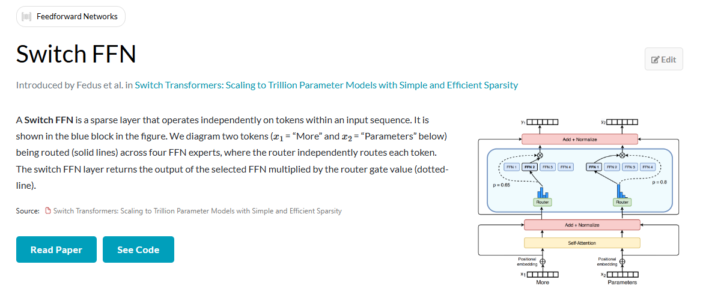
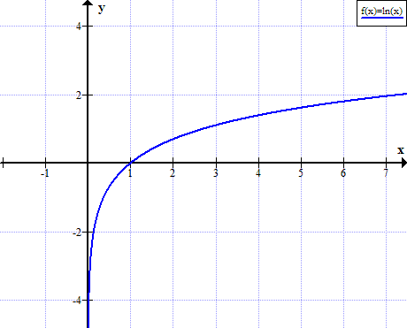
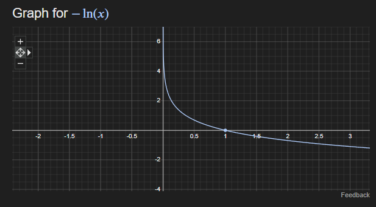
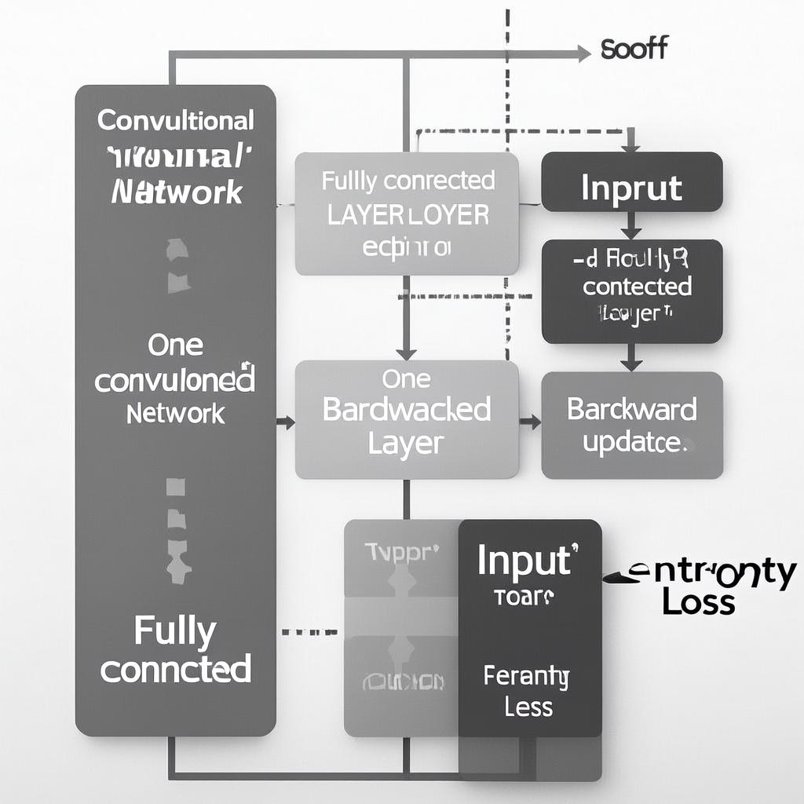

**2025-07-09**\
It's not really a textbook in a classical sense, just a pile of information I found and *found* interesting (not necessarily it means I *understood* it though, because I like to stare at something I don't understand).\
Ok, here's the information about switch FNN (the subset of the multi-branched neural networks, that contain different kinds of neural networks to process some information). I didn't understand what is said on the picture very well, but it looks interesting.\
\
It's an MoE (mixture of experts) approach to improve efficiency and performance, the name tells what it does pretty explicitly.\

**How softmax works.**\
The code is:
```Python
def softmax(x):
    exps = np.exp(x - np.max(x))  # Numerically stable
    return exps / np.sum(exps)
```
1) It's numerically stable, because if the numbers of the input matrix (x) are high, then e^x is very high.\
`Input matrix: [50,90,100]`\
`(x-np.max(x)): [-50,-10,0]`\
But what if:\
`Input matrix: [0,0,100]`? Then\
`(x-np.max(x)): [-100,-100,0]`,\
that doesn't imporve the situation at all.\
UPD: I asked QWEN, and it said that in case of the very low numbers [-100,-100,0] we get underflow, and it's pretty good, if we don't need the *exact* small numbers. In this case we get `exps([-100,-100,0]) ≈ [3.7e-44, 3.7e-44, 1]`, and it's practically totally fine, because it's the one-hot result.
2) In the 2nd line `exps / np.sum(exps)` makes the same array, but that sums to 1 (because of the nature of the division operation).\
To put it simply, if we have an list [1,2,3], then sum is 6, and the output list is [1/6,2/6,3/6]=[1/6,1/3,1/2], that sums up to 1, making all the output numbers effeciently the probabilites.

**2025-07-11**\
Btw, use the common slashes and `./` for the picture's directory in the .md files (where `./` is a current directory).\
Let's discuss the formula in the code:
```Python
def cross_entropy_loss(probs, label):
    return -np.log(probs[label]+1e-10)
```
It's the natural logarithm:\
\
That we convert into the -ln(x):\
\
The 2nd graph means that if the function's input (`probs[label]`) is low, we get a higher number. If the prediction is high, we get a lower number. At x=1 y=0 (almost). It's made this way, because if the prediction is close to 1 (high), then the loss should be smaller. The input probability shouldn't be higher than 1, because the input ptobability is (ideally) the output of the softmax function, and the sum of its outputs can't be higher than 1.\
Btw, the important math fact:
```math
1e-10=10^{-10}
```
but:
```math
1^{-10}=1/{1^{10}}=1
```
so:
```math
1e-10≠1^{-10}
```
So don't confuse these 2.

**2025-07-12**\
A sparse vector is a vector where most of the elements are zero. For example, the `dCrossEntropyLoss/dSoftmaxProbabilites` gives us the sparse graident vector.\
The CNN with a fully-connected layer, softmax and cross-entropy loss. Painted by QWEN. I wonder how much time will pass until we look at this and wonder how neural networks could be so ineffective.\


**2025-07-22**\
And interesting visualization ChatGPT wrote me during the discussion of the gradient flow during backpropagation from CE loss to Softmax output to Softmax input. I was asking how the backprop result changes, if we take different *streams* of the gradient flow. For example, what if we take the gradient flow only for the incorrect class for the $dL/dS_j$, and for all classes for the $dS_j/dzi$? In this case, according to ChatGPT (and what I understand), the result of such gradient flow is 0.\
💡 Visualization of gradient flow:
<pre>
          z0 ─┬─► s0 ──┬─► L
          z1 ─┤        │
          z2 ─┘        ▼
                   ∂L/∂sy ≠ 0
          (∂L/∂sj = 0 for j ≠ y)
</pre>

**2025-08-02**\
ChatGPT told me about 3 types of convolution in CNNs, and it's kinda interesting. Especially I'm glad it's one thing that is interesting and easy to understand. Here's what it wrote.

🧠 Why “valid” convolution?

“**Valid**” doesn’t mean “correct” or “approved by the Convolutional Council of Elders.” It’s just one of **three** standard modes of convolution padding. Let’s break them down:

1. 🟢 **"valid" convolution** (used in your code)

* No padding is applied.
* Output shrinks:
  If input is $28 \times 28$, and kernel is $3 \times 3$, output becomes $26 \times 26$.
* Formula:
  $\text{output size} = \text{input size} - \text{kernel size} + 1$

2. 🔵 **"same" convolution**

* Adds padding so output size equals input size.
* Common in modern CNNs (like in TensorFlow/Keras).
* Useful for stacking many layers without shrinking too much.

3. 🟡 **"full" convolution**

* Adds *maximal* padding.
* Output becomes *larger* than the input.
* Rarely used in practice unless for some signal-processing or old-school deconvolution vibes.

So no, other convolutions aren’t invalid. “Valid” is just the Spartan version—no padding, no cheating, no mercy.

**2025-08-05**\
ChatGPT changed the QWEN's part of the code of the first CNN I study right now.\
It said there's a bug.\
The original code:
```Python
def grad_max_pool(dpool_out, relu_out, size=2, stride=2):
    d_relu = np.zeros_like(relu_out)
    ph, pw = dpool_out.shape

    for i in range(ph):
        for j in range(pw):
            # Get the region from the ReLU output
            region = relu_out[i*stride:i*stride+size, j*stride:j*stride+size]
            max_pos = np.unravel_index(np.argmax(region), region.shape)

            # Set gradient only for the max position
            d_relu[i*stride + max_pos[0], j*stride + max_pos[1]] = dpool_out[i, j]
    
    return d_relu
```
*THe explanation*\
🧨 What’s wrong with it?\
🔻 1. This line is broken:
```Python
region = np.zeros((size, size))
region_idx = np.unravel_index(np.argmax(region), region.shape)
```
It tries to find the max position inside a region…\
 …but the region is all zeros!\
So np.argmax(region) will always return (0, 0). Meaning:\
The gradient dpool_out[i,j] always goes to the top-left corner of the pooling window,

Even if the max value wasn’t at (0,0) during the forward pass,

💀 That’s incorrect and will ruin training.

🔧 How to fix it\
We need to pass in the original output of the ReLU, so we can find the max position during the forward pass for each pool region.\
✅ Fixed version:
```Python
def grad_max_pool(dpool_out, relu_out, size=2, stride=2):
    d_relu = np.zeros_like(relu_out)
    ph, pw = dpool_out.shape

    for i in range(ph):
        for j in range(pw):
            # Get the region from the ReLU output
            region = relu_out[i*stride:i*stride+size, j*stride:j*stride+size]
            max_pos = np.unravel_index(np.argmax(region), region.shape)

            # Set gradient only for the max position
            d_relu[i*stride + max_pos[0], j*stride + max_pos[1]] = dpool_out[i, j]
    
    return d_relu
```
🔄 And in the call site:\
You need to change the line where it's used:
```Python
dx_relu = grad_max_pool(dx_pool, relu_out.shape)
```
🔁 Becomes:
```Python
dx_relu = grad_max_pool(dx_pool, relu_out)
```

**2025-08-29**\
I've got a funny thought. What if we add a small FC layer into each kernel? Or maybe into each application of the kernel onto the image. I don't really think about the details, just got the rough idea. It would be interesting to create such network.\
ChatGPT didn't say anything really bad about it. Basically it's much higher complexity (the exploding number of weights and  biases) and hence computationally heavy forward pass and backpropagation.

**2025-08-30**\
I changed the formula used in the max pooling, that counts the output height (or width), to make it more intuitive.\
The original formula: `out_h = (h - size) // stride + 1`\
The changed formula: `out_h = (h - size + stride) // stride`\
In the changed formula you explicitly see that we subtract the size of the pooling window from the height (height of the matrix with the map of the features) with `h - size` (because we need to do the pooling only at the tile with `last_tile_index-pooling_window_size` index, or something like this), then add the stride to see if it overshoots with `+ stride`, and then check how many times we can apply the pooling and we remove the overshooting with `// stride`.

**2025-09-10**\
A funny idea with a funny result.\
My idea:\
What about this?😄
```Python
np.random.shuffle([bow,pistol,rifle,shotgun])
```
ChatGPT reply:\
Hehe 😄 that’s even sneakier — but it still won’t do what you think.
When you write this, you’re creating a temporary list, handing it to shuffle, which shuffles it in place… and then that list is immediately thrown away, since you didn’t store it anywhere. So the line runs, but nothing is kept.\
It’s like shuffling a deck of cards and then tossing the whole deck into the trash.

**2025-09-11**\
**ChatGPT on how to vectorize the nested loops in CNN, making it significantly faster.**

Perfect — we can make your CNN way faster without leaving “from scratch” land. The key is **vectorization**: avoid Python `for` loops and use NumPy operations that run in compiled C under the hood. Here’s the breakdown.

1. **Convolution with `numpy` stride tricks**

Instead of nested loops:

```python
for i in range(out_h):
    for j in range(out_w):
        region = image[i:i+kh, j:j+kw]
        output[i,j] = np.sum(region * kernel)
```

You can use **NumPy’s `as_strided`** to extract all sliding windows at once:

```python
import numpy as np
from numpy.lib.stride_tricks import as_strided

def conv2d_vectorized(image, kernel):
    h, w = image.shape
    kh, kw = kernel.shape
    out_h = h - kh + 1
    out_w = w - kw + 1

    shape = (out_h, out_w, kh, kw)
    strides = image.strides * 2
    patches = as_strided(image, shape=shape, strides=strides)
    
    # elementwise multiply + sum over kernel dims
    output = np.einsum('ijxy,xy->ij', patches, kernel)
    return output
```

✅ No explicit Python loops — **huge speedup**, even for 300×300 images.

2. **Batching**

If you plan to process multiple images, you can stack them and do a batch convolution using `np.einsum` or `np.tensordot`.

```python
batch = np.stack([img1, img2, img3])  # shape (batch_size, H, W)
# then apply conv2d_vectorized for each image in batch
```

3. **Max-pooling vectorization**

Instead of nested loops for max-pooling, you can also use **reshaping + max along axes**:

```python
def max_pooling_vectorized(x, size=2, stride=2):
    h, w = x.shape
    x_reshaped = x[:h-(h%size), :w-(w%size)].reshape(h//size, size, w//size, size)
    return x_reshaped.max(axis=(1,3))
```

4. **Other tips**

* Flattening, fully connected layers, ReLU, and softmax are already **fast in NumPy**.
* Avoid Python-level loops wherever possible; NumPy vectorization is often **100–1000× faster**.

**Another reply for a more detailed explanation of the vectorization.**

Absolutely. Let’s break it down carefully, because **vectorization is the secret sauce in NumPy for speed**.

Right now your `conv2d` is doing this:

```python
for i in range(out_h):
    for j in range(out_w):
        region = image[i:i+kh, j:j+kw]
        output[i, j] = np.sum(region * kernel)
```

So for **every output element**, it slices the input and multiplies element-wise with the kernel. This is fine for learning, but **Python loops are slow**, because every `for` iteration happens in Python bytecode.

**Vectorization idea**

Instead of looping, we **reshape the image into overlapping patches** and do all multiplications at once with matrix operations. NumPy does this in compiled C code, which is **orders of magnitude faster**.

For example, for a 2D convolution:

1. **Extract all patches of the input** that the kernel will slide over.

   * This is called **im2col** in CNN libraries.
   * You get a 2D array where each row is a flattened patch corresponding to one position of the kernel.

2. **Flatten the kernel** into a 1D vector.

3. **Dot product**: multiply the patch matrix by the flattened kernel vector.

   * This gives the convolution output in **one shot**, no loops.

**A small example**

```python
import numpy as np
from numpy.lib.stride_tricks import as_strided

def conv2d_vectorized(image, kernel):
    h, w = image.shape
    kh, kw = kernel.shape
    out_h, out_w = h - kh + 1, w - kw + 1

    # create sliding windows
    shape = (out_h, out_w, kh, kw)
    strides = image.strides * 2
    patches = as_strided(image, shape=shape, strides=strides)
    
    # reshape patches to (num_patches, kh*kw)
    patches_reshaped = patches.reshape(-1, kh*kw)
    
    # flatten kernel
    kernel_flat = kernel.flatten()
    
    # dot product to get convolution output
    conv_out = patches_reshaped @ kernel_flat
    return conv_out.reshape(out_h, out_w)
```

✅ This code avoids Python loops entirely. All multiplications are done **inside highly optimized C routines** in NumPy.

**2025-09-13**\
I want to copy this from my ML diary, because it's important.\
Today I understood something very important, that I didn't realize before.\
There are 3 types of derivatives:
1. Scalar w.r.t. to another scalar. y=2x, dy/dx=2.
2. Scalar w.r.t. to a matrix. This what we use in machine learning. Loss is a scalar, and weight (bias, layer, activation) is a matrix. The derivative dL/dW (or w/e) in this case is a matrix with the same shape as input! This is why it's so simple.
3. Matrix w.r.t. to another matrix. This is what we don't usually do in ML, especially because such derivative is a 4D tensor.

**2025-10-04**\
About
```Python
main_loss=cross_entropy_loss(probs,true_label)
loss=main_loss+0.001*np.sum(kernel**2) #L2 regularization
```
that is the regularzation trick, to make a penalty to the network for too large weights and make it generalize better. ChatGPT asked me:\
**Do you understand why we square the weights instead of taking their absolute value (which would be L1 regularization)?**\
And the answer is:
1. If you just summed the weights without squaring, positive and negative weights could cancel each other out. That would defeat the purpose — a large negative weight should be “penalized” just like a large positive one.
2. Squaring gives a **differentiable, smooth function**. Gradient w.r.t a weight (w) is linear:
  ```math
  \frac{\partial}{\partial w} w^2 = 2w
  ```
3. Connection to MSE? Kind of. MSE squares the errors to penalize bigger mistakes more strongly and to avoid negatives canceling positives. L2 regularization does a similar “big weights hurt more” logic, but the main reason is **positivity and smoothness**, not the negative values per se.

What would happen if you used negative values? If you allowed negative contributions (just sum `w`), large positive and negative weights could cancel → network could still have huge weights but the regularization term might look small → defeats the purpose.\
Squaring makes every weight contribute positively to the penalty, so the network is truly encouraged to **keep all weights small**, not just balanced in sign.\
**TL;DR:**\
We use squares mainly for **positivity + smooth gradients**, not just to avoid negative numbers.\
L2 “pulls weights toward 0” smoothly, which helps prevent overfitting.

**2025-10-17**\
DCGAN is a Deep Convolutional Generative Adversarial Network.\
Usual GAN has fc layers. DCGAN uses convolution instead of fc layers. It allows it to generate pictures and better understand spatial relationships.

**2025-11-07**\
Fun Mathematical Property of the `tanh` function:
```python
tanh(x) ≈ x for small x  # Linear region
tanh(x) ≈ sign(x) for large x  # Saturation
```
This gives it both linear and non-linear behavior!


